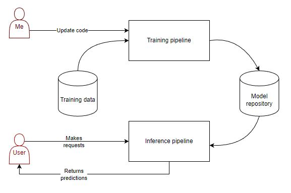

<!-- PROJECT LOGO -->
<br />
<div align="center">
  <a href="https://github.com/Xinyu-ham/nlp-pipeline">
    
  </a>

  <h1 align="center">Fake News Detection from Training to Deployment</h1>

  <p align="center">
    A complete end-to-end MLOps pipeline for a simple multimodal Machine Learning project.
    <br />
    <a href="#introduction"><strong>Start Here! »</strong></a>
    <br />
    <br />
    <a href="#installation">View Demo</a>
    ·
    <a href="https://github.com/Xinyu-ham/nlp-pipeline/issues">Report Bug</a>
    ·
    <a href="https://github.com/Xinyu-ham/nlp-pipeline/issues">Request Feature</a>
  </p>
</div>

## Table of Contents
- [End-to-End MLOps pipeline](#end-to-end-mlops-pipeline)
  - [Table of Contents](#table-of-contents)
  - [Introduction](#introduction)
  - [Project Structure](#project-structure)
    - [Chapter 0: Feature Engineering](#Chapter-0)
    - [Chapter 1: Baseline Model](#Chapter-1)
    - [Chapter 2: Hyperparameter tuning](#usage)
    - [Chapter 3: Experiment Tracking with MLflow](#contributing)
    - [Chapter 4: Distributed Training with Torch Run](#license)
    - [Chapter 5: Cloud Training with EKS](#contact)
    - [Chapter 6: Model Serving with <Torch Serve?? maybe>](#contact)
    - [Chapter 7: Inference Pipeline and Deployment](#contact)
    - [Chapter 8: Model Monitoring and Decay Detection](#contact)
    - [Chapter 9: Automated Retraining Pipeline with Airflow](#contact)

---

## Introduction
The purpose of this project is to develop a complete, industrial grade Machine Learning system. The project is based on a simple multimodal Machine Learning project, which is to detect fake news from news headlines. This project is designed to be a complete end-to-end MLOps pipeline, which ensures continuous integration, continuous delivery and continous training of a Machine Learning system. The project is also designed to be scalable and reproducible, which means it can be easily deployed to a cloud platform and can be easily reproduced by other developers. 

This project will include not only the finished code, but will also document the process of developing the project. The project will be developed in an iterative and modular way, where we explore different modern technologies that are designed to help ML practitioners to develop a robust and scalable ML system.

> I assume anything or anyone who bothers reading the whole thing is either probably just starting out in their ML journey or just really really bored. I do not want to get into the details with modeling, so ensure you have the basic knowledge of Machine Learning tools like Jupyter and Deep Learning using PyTorch. Some knowledge of transformers and NLP is good too. Also, basic software development stuff would help a lot.


### A complete end-to-end MLOps pipeline
Machine Learning in the real world is not just about training a model. Once can argue that less than 10% of the codebase actually contains the model code. 

  Figure 1:
  <a href='https://cloud.google.com/architecture/mlops-continuous-delivery-and-automation-pipelines-in-machine-learning#top_of_page'>
    Elements of ML systems as described by Google Cloud
  </a>
</img>


In MLOps, there are three maturation levels of a Machine Learning system: level 0, 1 and 2. (Obviously, we don't count from 1 unlike R or MatLab.) A simple overview is:
- Level 0 contains barely all necessary pieces to deploy a Machine Learning model to production, but had done so manually. AKA, I do everything in Jupyter Notebooks phase.
- Level 1 allows automation of pipelines and achieve CI/CD in the deployment of a Machine Learning model.
- Level 2 allows automation of the entire Machine Learning system, including automated retraining, monitoring and automated deployment. On top of that, the system is scalable and reproducible.

This project aims to minimally achieve level 1, and maybe contains some level 2 features. There are many aspects of a level 2 system that are hard to achieve with a personal project, such as thousands of users per second or a budget that's way over $50. But we will try to achieve as much as we can.

## Project Structure
So as mentioned above, I wanted to build a model for a simple ML problem. I found a relatively small dataset that contains a bunch of news headlines with labels telling us if the news is real or fake. The dataset is from Kaggle, and can be found [here](https://www.kaggle.com/datasets/thesumitbanik/covid-fake-news-dataset).

```WHO warns against consuming cabbage to prevent COVID-19 -> 0 (Fake)```

As you can see, the dataset is as simple as it gets. Some text and a label. That's it. There are species of jellyfish with anatomies more complex than this dataset. We are going to build a simple classifier. This is by design, as I want the focus of this project to be the engineering of the system, not the model.

The model will be deployed to the cloud, with just a web app for user to type random BS on a web UI and get called out by a bot. The key here is assume that we are some big shot company with **A LOT** of users and **A LOT** of data, and we want to build a system that can handle all that. Fake it till you make it, you know?

### Overview
The general approach to this project is to gradually step up the complexity from the very basic. As how most people get started with Machine Learnig, an ML process looks like this:


The training pipeline is typically a Jupyter Notebook and the model is being saved locally, if at all. With a model saved, we can write some simple code to load the model and make predictions. We can wrap the code in Flask/FastAPI and deploy it to a server as a REST endpoint. 
Next, we can think about storing the model somewhere easily retrivable by the inference pipeline, and we can save multiple versions of the model whenever we update our training code, or rerun the model with new data. 

BAM! Now we have a 👶 ML system. It's not much, but it's honest work.



First of all, at this point, you should definitely start to do version control of your code. Like, seriously. You should have done it from the beginning. But if you haven't, now is the time. Just use GitHub or sth, or GitLab if you like orange.

An additonal benefit of using these services is that they also come with some basic CI/CD tools like GitHub Actions and GitLab CI. 


In real life, we want to be able to quickly experiment, and play with different parameters. ML requires a lot of experimentation, and we want to be able to quickly test our new ideas, and have somewhere we can easily compare the results. 👀👀 This is where ML experiment tracking tools come in. There are many tools out there, but I will be using MLflow for this project. You can also use TensorBoard, WandB, Neptune, or the dashboard that comes with integrated ML platforms like AWS SageMaker or Google's Vertex AI.

Next, we should also think about containerizing our code for the purpose of reproducability. What if your house got burnt down along with your laptop 🔥🔥? What happens if your code doesn't run on a new one? I assume that would be quite unpleasant. Containerizing your project in docker is a good way to ensure that your code can be easily reproduced in any environment, including ☁️☁️. 

Still, we are not at level 1 yet. We still have to manually run our training code, so we can implement a simple retraining mechanism. Perhaps a good start is to do a CRON job that runs the training code every week.


At this stage, it doesn't make sense to still do the training on our local machine. We can put most stuff in the cloud, like AWS. We can use AWS S3 to store our data and model, and use AWS EC2 to run our training code. We can also use AWS Lambda to run our inference code serverlessly. With GitHub actions, we can also easily build and push our docker image to a container registry like Docker Hub or AWS ECR, and even rebuild the image whenever we update our code. Pretty cool if I do say so myself. 

Of course, we can also use AWS SageMaker to do all of that, but **that would be cheating, wouldn't it**? 😏 You know what, serverless infrastructure is cheating too, let's *really* feel the pain. I know half of y'all reading this like it.

In addition, we can also add a monitoring system to help us see if the incoming serving data is drifting from the training data. We can use AWS CloudWatch to monitor the performance of our model, and use AWS SNS to send us an email if the model is performing poorly. Then we can use a DAG scheduler like Apache Airflow to schedule a retraining job if the model is performing poorly.


At this point, we already have a very decent ML system running in the cloud, but in case you've forgotten, the goal of the project is to be **EXCESSIVE AF**. We want to assume we got **industrial** size of data (even though we have like 300mb, 9k rows of text). What if the data size becomes *bigger* than the memory we have in our machine? What if it takes us longer to train the model than for Moses spent in the desert before he led the Israelites back to Canaan? (Btw 40 years.) 

The good thing here is that we have the power of distributed computing on our side. Most industrial ML systems are not trained on your 5 year-old laptop that you once accidentally spilt coffee all over it. They are trained on a cluster of GPUs, or even TPUs if you're using GCP. With some useful functionalities in PyTorch, we can easily distribute our training code to multiple GPUs, across multiple nodes in a cluster.

As I add more things into the architecture, this is what I've visualized in my head:


Any sane person's immediate reaction to this monstrosity is "WTF is this sh*t?! This is a terrible and messy way to draw out your system!" and they will be right.

*Anyways...* let's get started.

To keep us sane, I'm going to split this project into 10 chapters. I will try to explain the concept and the technologies used as much as I can, but I'm not going to go into too much details. I will also try to keep the code as clean as possible, but I'm not going to spend too much time on that either. I'm not a software engineer, so I don't know how to write clean code. I'm just a guy who likes to build stuff. You have been warned.

## Chapter 0
### Feature Engineering
This chapter is called feature engineering, but it's also some EDA which I promise to keep it as short as possible. And here I also want to process the train data, and store them in a way that will be really helpful for a distributed training pipeline.

This chapter is in the [notebook](https://github.com/Xinyu-ham/nlp-pipeline/blob/main/preprocessing.ipynb). Come back when you're done reading. Or don't. I don't care.

## Chapter 1
### Baseline Model

In this chapter, I will build a baseline model with PyTorch. We are still working with a [notebook](https://github.com/Xinyu-ham/nlp-pipeline/blob/main/model.ipynb). Don't worry.

If you are starting out, chapter one is probably the most you've done. Everything after this point gets more and more exciting. By exciting, I mean more and more painful. Which is the same if you're a M..

Anyway, if you're a newbie that somehow stumbled across this, you will start to see things that you may not have come across in your ML journey, or maybe not. It's not really my priority that you learn. I don't even know you. I honestly don't even know why I'm doing this yet. 

## Chapter 2
### Hyperparameter tuning

Oh wait a minute, didn't I say at this point it's probably new stuff? Well, I lied. But I'm going to do it anyway beacuse it's important.

Most of us started out doing hyperparameter optimization using a grid search, which is a systematic way of trying every possible combinations of parameters and see which is the best. It's a good way to start, but it's not very efficient. There are many other ways to do hyperparameter optimization, and I will be using a library called Optuna. You can use whatever tool you want like Keras Tuner or Ray Tune. I'm just using Optuna because it has a fish in its name, and I like fish.

Ok I feel like this needs to be said: **This section is not an optuna tutorial.** I'm not going to explain how it works, but I will explain how I use it. If you want to learn more about Optuna, you can check out their [documentation](https://optuna.readthedocs.io/en/stable/index.html).

#### How to search for stuff
Hyperparameter tuning sounds like a cool sci-fi term, but in reality, it's just a fancy way of saying "try of bunch of stuff and see what sticks." All you wanna do is just find a set of parameters that gives you the best performance.

Traditionally, you can just search for literally every possible combination of parameters, but that's not what the *cool kids* are doing these days. If you have thousands of possible combinations, you can't possibly train a model thousands of times. People these days have better things to do, like attempting TikTok challenges that can potentially hurt themselves or other people around them, or arguing with strangers on the internet about who is the worst character in Brooklyn 99 and why it is Gina.  

Anyway, back to the *cool kids.* The *cool kids* are using modern seach techniques that abuse statistics like Bayesian Optimization, or get themselves into serious gambling addiction with bandit-based approch like Hyperbands. Model tuning tools like Optuna and Keras Tuner provide implementations of these algorithms, and they are really easy to use. And like thousands of Data Scientists out there, you too can claim to use state-of-the-art techniques without knowing how any of them works.

#### Ok let's get started
First, we dump all the messy code we have in the notebook into a package with a very uninspiring name like `nlp_model`. I've split the code into two modules, one for preparing the Data Pipe and the other for the model.

Next, we make an entry point in the working directory called `train_single.py`, and a config file called `tuning.yaml`. At this point, you may start to wonder: why is the script called `train_single`? Well, I'm not going to reveal anything except this is a technique writers like to call *foreshadowing*.

The train script will help us create an optuna study and run the training code. The config file will define our 
search space, i.e., the parameters we want to tune, and the range of values we want to search for. It looks something like this:

```yaml
version: 1.0.0
version: 1.0.0
experiments:
  - id: "fake_news"
    name: "Fake News Detection - Tuning"
    parameters:
      - name: "NAME_OF_PARAMETER"
        type: "DATA_TYPE"
        minValue: 0.0001
        maxValue: 0.1
        scalingType: "Logarithmic"
    ...
```

#### How optuna works?

Optuna is a hyperparameter optimization framework that uses a technique called Tree-structured Parzen Estimator (TPE). It's a Bayesian optimization technique that uses a tree of probability distributions to model the relationship between the hyperparameters and the objective function. It's a bit like a decision tree, but instead of predicting a label, it predicts the best set of hyperparameters.

Optuna study comprises of 4 main components: an objective, a sampler, a pruner and a set of trials. Not going to really explain objective since the name is pretty self-explanatory. A sampler is the algorithm that tells optuna what's the next point in the search space to try. A pruner is the algorithm that tells optuna to stop searching in a certain region of the search space if it's not promising. Each study makes up a couple of trials, which are a specific configuration of hyperparameters chosen by the sampler.

All we then need to do is to replace the actual values used in the training code with a variable called 'suggestion', and then create the study. 

#### Trainer
After we dumped all the training code into a `Trainer` class in the package we made earlier. We extend the functionalites of the trainer by taking in the search space configurations, and allow us to pass in a different set of trial every time the `build_model`.

We first pass the config dictionary into the `Trainer` constructor and save the search space parameters into the object. We then make a static method `map_parameters_to_suggestion` to map each set of parameters to a `suggestion` variable.

After that, we create a `build_model` method, that construct a model using the suggestions.

```python
class Trainer:
  def __init__(..., config: dict, ...):
    ...
    self.parameters = config['parameters']
    self.suggestions = {}
  
  def build_model(trial: optuna.Trial) -> nn.Module:
    # some code to get the parameters from the trial
    for parameter in self.parameters:
        self.suggestions[parameter['name']] = self.map_parameters_to_suggestion(parameter, trial)
    ...

    self.model = FakeNewsModel(..., **params)
    return self.model
```

Finally, we return the model validation accuracy upon calling the `train` method. Here you might ask, wouldn't another metric like F1 or AUC be better? Yes, you are right. But I'm lazy, and I don't want to write more code. 

```python
class Trainer:
  ...
  def train(self, trial: optuna.Trial) -> float:
    ...
    return self._evaluate_validation_set(test_data_loader)

  def _evaluate_validation_set(self, data_loader: DataLoader) -> float:
    accuracy = ...
    return accuracy
```


#### Train script
To train the model, we get the trainer object we made in the package, and define the objective to be the accuracy value (or whatever metric you want) the `train` method outputs. 
```python
def objective(trial: optuna.Trial) -> float:
    return trainer.train(trial, ...)
```
We create a study by passing in the objective, sampler and pruner. In this case, I will be using default TPE sampler and Median Pruner, so I don't need to specify in the `create_study` method. 

```python
study = optuna.create_study(direction="maximize", study_name="I'm a dumbass study")
study.optimize(object, n_trials=69)
```

Finally, you can run it and get the best trial
```python
trial = study.best_trial
some_optional_function_to_save_best_model_somewhere(trial, model_location)
```

Some of you may think, wouldn't it be nice if there is somewhere we can actually keep track of the trials and maybe manage the experiments and their corresponding models? This is what we gonna do the next chapter.

## Chapter 3
### Experiment Tracking with MLFlow
Just in case you didn't know, Optuna comes with an extensive set of visualization library that helps you visualize trial results with many inbuilt goodness. We are not going to use that.


# This just for my own ref

Start local distributed run:
```sh
torchrun --standalone --nnodes=1 --nproc-per-node=gpu --rdvz-endpoint=localhost:0 train_multi.py
```
Start local MLFlow server:
```sh
mlflow server --default-artifact-root s3://xy-mp-pipeline/ --artifacts-destination s3://xy-mp-pipeline/mlflow
```

Install local dependencies for Kubectl:
```sh
source ./processes/install_local_tools.sh
```

Create all yaml files from templates
```sh
source ./processes/generate_yaml.sh
```

Start remote kube clutser, deploy etcd and kubeflow operator:
```sh
export CLUSTER_NAME=xy-mp-pipeline
source ./processes/create_cluster.sh $CLUSTER_NAME
```

Create and attach volumes:
```sh
source ./processes/create_pvc.sh
source ./processes/attach_volume.sh $CLUSTER_NAME
```

Delete everything:
```sh
source ./processes/clean-up.sh
```

---
TODOs:
- Add checkpoints to test file
- Build pods to create checkpoint path in shared storage and edit permission
- Run test
- Replace test file with actual
- Add git workflow for ci
